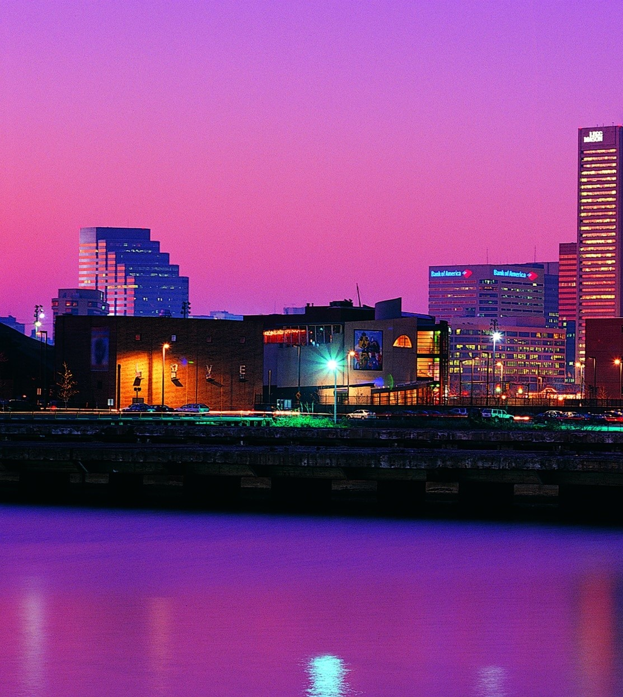
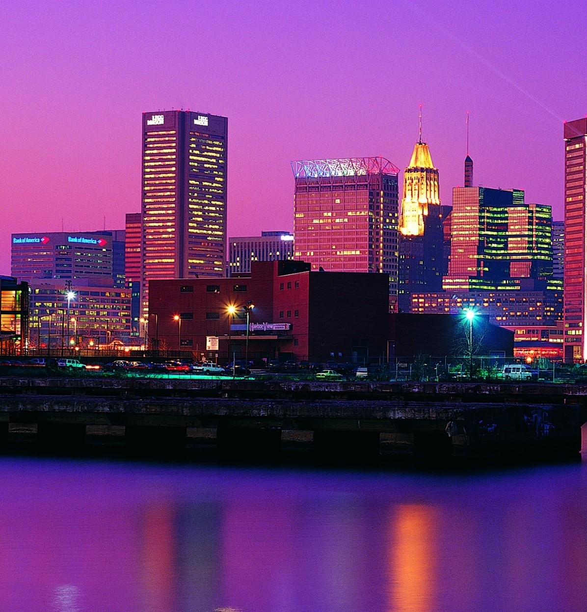
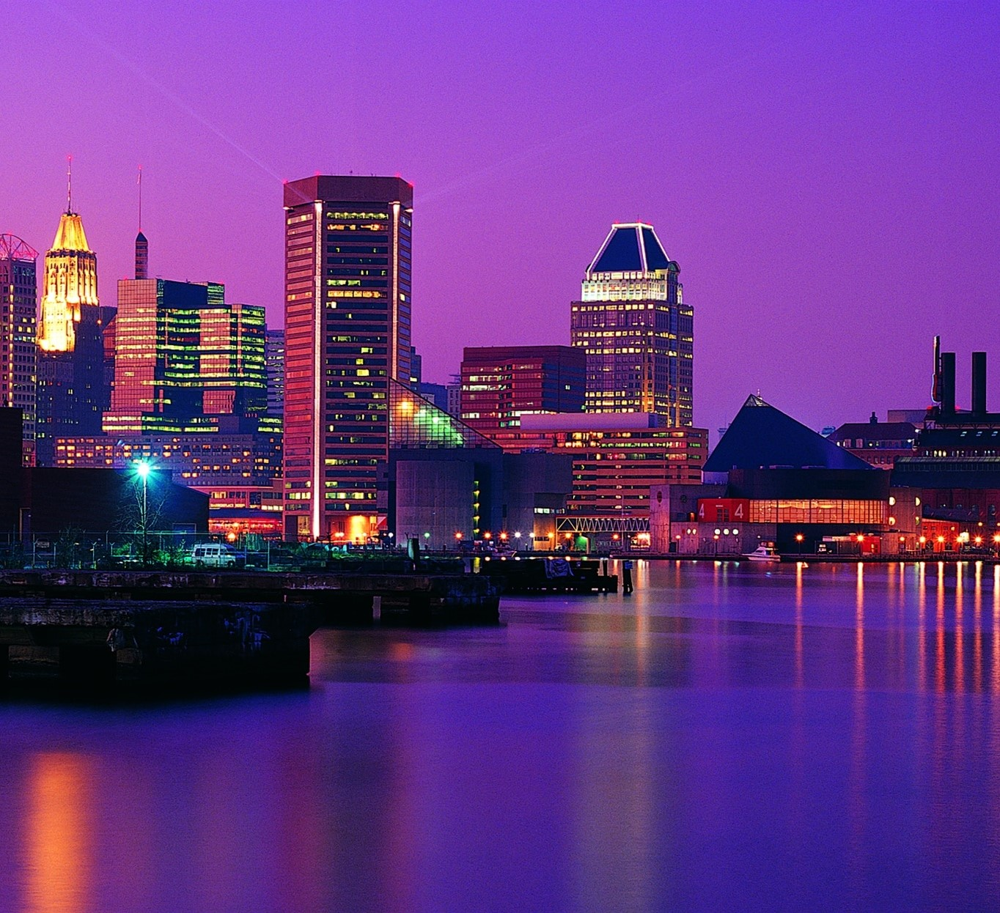
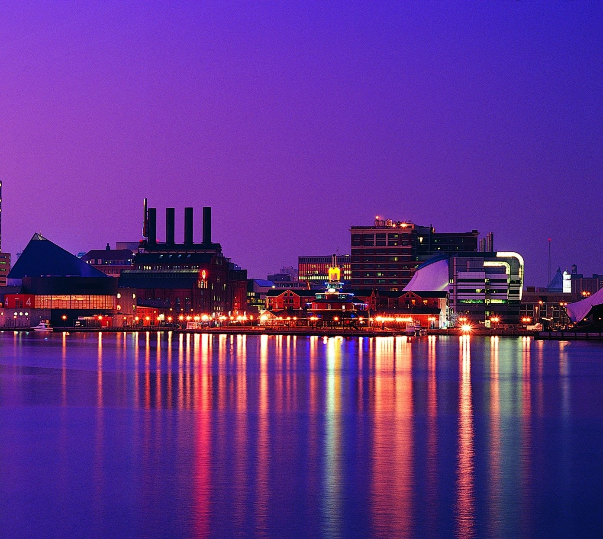

# Image Stitching Project
В проекте реализован алгоритм панорамного склеивания изображений без использования OpenCv. Были использованы базовые бибилиотеки для работы с изображениями, выявлением их признаков и выравнивания.

#### Пример входных изображений
Для работы изображения было разрезано на 4 части и далее алгоритм соединял его вновь в целостную картину.

   

#### Пример панорамного склеивания

#### Принцип работы
1. Нахождение ключевых точек с помощью ORB
2. Пары дикриптеров сопостовляются между последовательными изображениями с помощью Brute-Force matcher с перекрёстной проверкой
3. Для отфильтровывания выбросов и поиска преобразования используется алгоритм RANSAC с моделью ProjectiveTransform
4. Госмография для последующих изображений с учетом слеиваемой сцены
5. Сшивание с помощью максимальной интенсивности
6. Финальное изображение обрезаеться для удаления черных полос

#### Запуск программы
git clone https://github.com/your_username/your_project.git

pip install -r requirements.txt

python Image_Stitching.py
