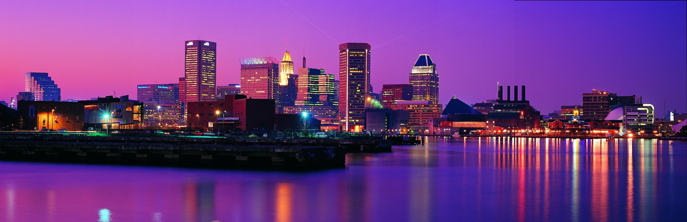

# Image Stitching Project
В проекте реализован алгоритм панорамного склеивания изображений без использования OpenCv. Были использованы базовые бибилиотеки для работы с изображениями, выявлением их признаков и выравнивания.

#### Пример входных изображений
Для работы изображения было разрезано на 4 части и далее алгоритм соединял его вновь в целостную картину.

[](images/night_city_1.jpg) [](images/night_city_2.jpg) [](images/night_city_3.jpg) [](images/night_city_4.jpg)

#### Пример панорамного склеивания

[](results/night_city.jpeg)

#### Принцип работы
1. Нахождение ключевых точек с помощью ORB
2. Пары дикриптеров сопостовляются между последовательными изображениями с помощью Brute-Force matcher с перекрёстной проверкой
3. Для отфильтровывания выбросов и поиска преобразования используется алгоритм RANSAC с моделью ProjectiveTransform
4. Госмография для последующих изображений с учетом слеиваемой сцены
5. Сшивание с помощью максимальной интенсивности
6. Финальное изображение обрезаеться для удаления черных полос

#### Запуск программы

1. Клонируйте репозиторий:
```bash
git clone https://github.com/KarinaCreate/your-repo-name.git
```

2. Установите зависимости:
```bash
pip install -r requirements.txt
```

3. Запустите основной скрипт:
```bash
python Image_Stitching.py
```
